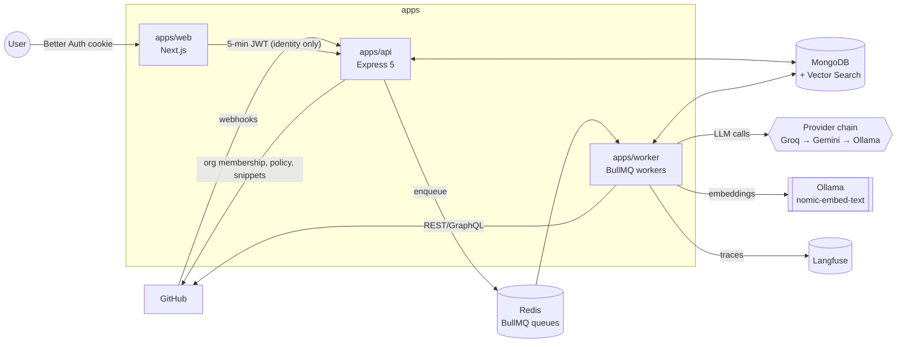

# MergeMind: Architecture

> The source of truth for system shape, folder layout, data model and API contracts. If code and this file disagree, fix one of them in the same PR.

---

## 1. System diagram



### Review flow (happy path)
```
GitHub ──POST /webhooks/github──► api
  1. verify X-Hub-Signature-256 (HMAC SHA-256, timing-safe)
  2. claim webhookDeliveries { deliveryId } (unique) ── duplicate? → 202 {status:"duplicate"}, stop
     (a `failed` or stale `received` row is reclaimed so GitHub redeliveries retry, ADR-016)
  3. route by event + action → installation events: sync inline; PR events: enqueue job
     (jobId = "<githubRepoId>#<prNumber>@<headSha>", ADR-017)
  4. respond 202 (target p95 < 300 ms)

worker (queue: review, job: review.pr)
  1. loadContext      installation token, PR metadata, .mergemind.yml @ the PR's base branch (ADR-033)
  2. budgetCheck      usageLedger month-to-date vs installation budget
  3. createCheckRun   mergemind/review → in_progress
  4. fetchDiff        files + patches; drop ignorePaths; compute changed lines
  5. sizeGate         > maxChangedLines → summary-only mode
  6. scopeIncremental push after a completed review: compare lastReviewedSha...head; only PR-diff
                     hunks with a changed line go to the LLM (anchoring still uses the full PR diff).
                     Force-push / 404 / not ahead / 300+ files: full review (ADR-023)
  7. chunkHunks       hunk groups ≤ token budget per LLM call
  8. retrieveContext  repo indexed: definitions of called names + $vectorSearch top-8 per chunk,
                     own hunks dropped, ~1,500-token budget; any failure means no context (ADR-025)
  9. runPasses        security | correctness | maintainability (parallel, p-limit)
 10. postProcess      Zod-validate → fingerprint → dedupe → suppressions → minConfidence
 11. reconcile        skip already-posted; incremental: resolve earlier findings whose code changed
                     and that nothing restates (reply "Resolved in <sha>", best-effort thread resolve)
 12. publish          ONE PR review with inline comments + summary; complete check run
                     (crash-safe: an existing review carrying the run marker is adopted, ADR-018)
 13. recordUsage      usageLedger rows per LLM call; emit review.completed
```

### CI failure flow
```
workflow_run.completed → api decides (ADR-028):
  failure | timed_out, with a linked PR or from a fork → ci-summary.run (outcome failed)
  success with a linked PR                             → ci-summary.run (outcome passed)
  anything else (cancelled, skipped, no PR)            → ignored
worker (failed):
  open PRs still at the run's head SHA (fork PRs looked up by SHA) → .mergemind.yml ciSummary.enabled (default branch)
  → comment already describes this run attempt or a newer one? stop
  → jobs of the attempt → failed jobs (max 3) → job logs (404/410 = expired)
  → strip timestamps + ANSI → failing step's section → window around ##[error] / error lines
    (≤ 150 lines, 8 KB per job) → redact tokens
  → budget + provider allowlist → LLM summary (failing step, likely cause, evidence lines, fix)
    (budget used up, no allowed provider, or outage on the last attempt → excerpt-only comment)
  → upsert ONE PR comment per workflow (marker <!-- mergemind:ci-workflow=<id> -->)
worker (passed): rewrite that comment to "passing again"; no LLM call, no new comment
```

### Indexing flow
```
push to default branch | installation created | POST /repositories/:id/reindex → queue index
worker: list changed files → parse symbols (tree-sitter or regex fallback) → chunk
        → embed (Ollama nomic-embed-text, 768 dims) → upsert codeChunks by (repoId, path, symbol)
        → delete chunks for removed files
```

---

## 2. Folder structure

```
mergemind/                         (repo root = A:\Projects\Mergemind)
├─ apps/
│  ├─ api/                         @mergemind/api      Express 5 HTTP server
│  │  ├─ src/
│  │  │  ├─ routes/                one file per resource (repositories.routes.ts, ...)
│  │  │  ├─ controllers/           thin: parse → call service → respond
│  │  │  ├─ services/              business logic, no req/res objects
│  │  │  ├─ webhooks/              signature verify, event router, handlers per event, controller + raw-body route
│  │  │  ├─ queues/                producers for the jobs the api enqueues (review, index, ci-summary)
│  │  │  ├─ middleware/            auth, validate(zod), requestId, errorHandler, rateLimit
│  │  │  ├─ config/env.ts          Zod-validated env
│  │  │  ├─ app.ts                 builds the express app (no listen; testable)
│  │  │  └─ server.ts              listen + graceful shutdown
│  │  └─ test/integration/         *.int.test.ts
│  ├─ worker/                      @mergemind/worker   BullMQ processors
│  │  ├─ src/
│  │  │  ├─ queues/                Redis connection for workers (names and job options live in @mergemind/shared)
│  │  │  ├─ processors/            one per job name: review.processor.ts, index.processor.ts, ci-summary.processor.ts
│  │  │  ├─ pipeline/              review stages (one file per stage, see §1)
│  │  │  ├─ indexing/              code index: tree-sitter chunker, file selection, index job
│  │  │  ├─ ci/                    CI failure summary: log windowing, redaction, run-ci-summary.ts
│  │  │  ├─ repository-visibility.ts  escalate-only visibility rule shared by every job (ADR-027)
│  │  │  ├─ config/env.ts
│  │  │  └─ main.ts
│  │  └─ test/integration/
│  └─ web/                         @mergemind/web      Next.js App Router
│     ├─ src/app/                  routes (see Design.md §8)
│     ├─ src/components/ui/        shadcn/ui (customized, never default state)
│     ├─ src/components/           feature components
│     ├─ src/lib/                  api client, auth
│     └─ e2e/                      Playwright *.spec.ts
├─ packages/
│  ├─ shared/                      @mergemind/shared   Zod schemas, types, constants, errors
│  │  └─ test/fixtures/github/     recorded webhook payloads
│  ├─ db/                          @mergemind/db       Mongoose connection, models, repositories
│  ├─ llm/                         @mergemind/llm      provider chain, prompts, structured output, usage
│  └─ github/                      @mergemind/github   Octokit App client, diff parser, publisher
├─ evals/                          @mergemind/evals    seeded-bug fixtures + runner
├─ .agents/skills/                 installed agent skills (design-taste-frontend, minimalist-ui)
├─ .claude/skills/                 junctions → .agents/skills (Claude Code)
├─ docker-compose.yml              atlas-local, redis
├─ .env.example                    every env var, no real values
├─ .nvmrc                          22
├─ package.json                    workspaces + root scripts
├─ tsconfig.base.json             strict settings shared by all workspaces (+ tsconfig.build.json per workspace)
├─ eslint.config.js               flat config, typescript-eslint strictTypeChecked
├─ test/setup/                    Testcontainers global setup (containers.ts) + inject() types
├─ vitest.config.ts                projects: unit, int
└─ PRD.md AGENTS.md CLAUDE.md Design.md Architecture.md rules.md memory.md Decisions.md Testing.md
```

**Dependency direction (enforced by review, later by eslint-plugin-boundaries):**
`apps/*` → `packages/*`. `packages/db`, `packages/llm` and `packages/github` → `packages/shared`. No package imports an app. `packages/llm` and `packages/github` do not import each other.

---

## 3. Design patterns

| Pattern | Where | Why |
|---|---|---|
| **Async request-reply (202 + queue)** | Webhook → BullMQ | GitHub expects a response within 10 s; reviews take 30-90 s |
| **Idempotent consumer** | `webhookDeliveries` unique index + deterministic BullMQ `jobId` | GitHub redelivers; the same `headSha` must never be reviewed twice concurrently |
| **Pipeline / chain of responsibility** | `apps/worker/src/pipeline/*` | Each stage is small, testable, skippable (summary-only, incremental) |
| **Strategy + fallback chain** | `packages/llm/src/providers` | Swap Groq/Gemini/Ollama by config; fall over on 429/5xx/timeout |
| **Circuit breaker** | per provider in `packages/llm` | Stop hammering a provider that is rate-limited; half-open after cooldown |
| **Repository pattern** | `packages/db/src/repositories` | Services never touch Mongoose directly; queries are bounded and indexed |
| **Policy object** | `ReviewPolicy` (parsed `.mergemind.yml`) + `SeverityGate` | Business rules in pure functions, unit-testable without IO |
| **Fingerprinting** | `findings.fingerprint` | Stable identity across line shifts → dedupe + resolve + suppress |
| **Retry with jittered exponential backoff** | BullMQ job options, Octokit throttling plugin | Transient GitHub/LLM failures |
| **Outbox-style delivery log** | `webhookDeliveries` (status: received → enqueued → failed) | Replay failed deliveries; audit trail |
| **Graceful shutdown** | api + worker | Finish in-flight jobs on SIGTERM; BullMQ `worker.close()` |

---

## 4. Database schema (MongoDB)

Collection names are plural camelCase. All documents have `createdAt` and `updatedAt` (Mongoose timestamps). IDs are ObjectId unless noted.

### `installations`
| Field | Type | Notes |
|---|---|---|
| githubInstallationId | number | unique |
| accountLogin | string | org or user login |
| accountType | `'Organization' \| 'User'` | |
| status | `'active' \| 'suspended' \| 'deleted'` | |
| monthlyTokenBudget | number | default 2,000,000 |
| allowedProviders | `('groq' \| 'gemini' \| 'ollama')[]` | for private repos; default `['groq','ollama']` |

Indexes: `{ githubInstallationId: 1 }` unique.

### `repositories`
| Field | Type | Notes |
|---|---|---|
| installationId | ObjectId → installations | |
| githubRepoId | number | unique |
| fullName | string | `owner/name` |
| isPrivate | boolean | drives provider allowlist. Jobs may only raise it to true; only `repository` events and live GitHub reads lower it (ADR-027) |
| defaultBranch | string? | unknown until a pull_request/push payload names it (installation payloads omit it) |
| isInstalled | boolean | false once removed from the installation or the app is uninstalled (PRD F1) |
| isEnabled | boolean | toggled from UI; reviews need `isInstalled && isEnabled` |
| indexStatus | `'none' \| 'indexing' \| 'ready' \| 'failed'` | |
| lastIndexedSha | string? | head of the last completed index (base of the next incremental index) |

Indexes: `{ githubRepoId: 1 }` unique, `{ installationId: 1, fullName: 1 }`.

### `pullRequests`
| Field | Type | Notes |
|---|---|---|
| repositoryId | ObjectId | |
| number | number | |
| title, authorLogin, baseRef, headRef | string | |
| headSha | string | latest seen |
| lastReviewedSha | string? | for incremental review |
| state | `'open' \| 'closed' \| 'merged'` | |
| isDraft | boolean | |
| githubUpdatedAt | Date | `pull_request.updated_at` of the newest applied event; older events never overwrite (out-of-order guard) |

Indexes: `{ repositoryId: 1, number: 1 }` unique, `{ repositoryId: 1, state: 1, updatedAt: -1 }`.

### `reviewRuns`
| Field | Type | Notes |
|---|---|---|
| pullRequestId, repositoryId | ObjectId | |
| headSha, baseSha | string | |
| trigger | `'opened' \| 'synchronize' \| 'reopened' \| 'ready_for_review' \| 'manual'` | |
| mode | `'full' \| 'incremental' \| 'summary_only' \| 'skipped'` | |
| status | `'queued' \| 'running' \| 'completed' \| 'failed'` | |
| skipReason | string? | `budget_exhausted`, `draft`, `disabled`, ... |
| checkRunId | number? | GitHub check run |
| gateConclusion | `'success' \| 'failure' \| 'neutral'`? | |
| counts | `{ critical, major, minor, suppressed, filtered, duplicate, merged, resolved }` | severity counts = every open finding on the **PR** after this run (the gate input, ADR-023); `duplicate` = already reported earlier; `merged` = cross-pass restatements (ADR-021); `resolved` = earlier findings this push fixed |
| tokens | `{ input, output }` | |
| timings | `{ queuedMs, fetchMs, retrieveMs, llmMs, publishMs, totalMs }` | |
| promptVersion | string | the passes run, e.g. `security@1+correctness@1+maintainability@1` |
| attempt | number | starts at 1; manual rerun on the same SHA increments it |
| error | `{ code, message }`? | |
| githubReviewId | number? | set once the review is posted (with the body marker, prevents a second post) |
| analyzedAt | Date? | findings persisted; a retried job skips the LLM passes |
| isBudgetWarning | boolean | month-to-date usage ≥ 80% of the budget |
| policyErrors | string[] | problems in `.mergemind.yml` (defaults were applied) |
| failedPasses | pass[] | passes that no provider completed for every chunk |

Indexes: `{ pullRequestId: 1, createdAt: -1 }`, `{ repositoryId: 1, headSha: 1, attempt: 1 }` unique (one run per SHA per attempt), `{ status: 1, updatedAt: 1 }`.

### `findings`
| Field | Type | Notes |
|---|---|---|
| reviewRunId, pullRequestId, repositoryId | ObjectId | |
| pass | `'security' \| 'correctness' \| 'maintainability'` | |
| severity | `'critical' \| 'major' \| 'minor'` | |
| confidence | number 0-1 | |
| path | string | |
| lineStart, lineEnd | number | on the head side of the diff |
| title, body | string | |
| suggestion | string? | code suggestion block |
| fingerprint | string | sha256(pass + path + normalized code + title-slug) |
| state | `'open' \| 'resolved' \| 'dismissed' \| 'filtered'` | |
| githubCommentId | number? | set after publishing |
| resolvedInSha, resolvedByRunId | string?, ObjectId? | set when an incremental review finds the push fixed it (ADR-023) |
| category | `FINDING_CATEGORIES` | injection, hardcoded-secret, missing-await, ..., other (eval matching) |
| placement | `inline | summary` | inline = review comment; summary = listed in the review body (ADR-020) |

Indexes: `{ pullRequestId: 1, fingerprint: 1 }` unique, `{ reviewRunId: 1, severity: 1 }`, `{ pullRequestId: 1, state: 1 }` (PR-wide gate and resolution candidates).

### `codeChunks`
| Field | Type | Notes |
|---|---|---|
| repositoryId | ObjectId | |
| path, symbol | string | `symbol` is qualified and unique per file (`UserService.save`, `save#2`, `lines:1-60`) |
| name | string | last segment of `symbol`, for definition lookup by called name |
| kind | string | `function \| class \| method \| interface \| type \| module \| window` |
| language | string | tree-sitter grammar (`typescript`, `tsx`, `javascript`, `python`, `go`, `java`) or the extension for window-only files |
| startLine, endLine | number | |
| contentHash | string | skip re-embed if unchanged |
| content | string | capped at ~1,500 tokens |
| embedding | number[768] | nomic-embed-text (`search_document:` prefix) |
| embeddingModel | string | model that produced `embedding` |
| commitSha | string | |

Indexes: `{ repositoryId: 1, path: 1, symbol: 1 }` unique, `{ repositoryId: 1, name: 1 }`. Created by the worker at boot (`ensureVectorSearchIndex`, non-fatal; create it in the Atlas UI if the driver call is refused). **Atlas Vector Search index** `code_chunks_vector`: `embedding` (768, cosine) with filter field `repositoryId`. (M0 allows max 3 search indexes; this uses 1.)

### `suppressions`
`{ repositoryId, fingerprint, reason?, createdByLogin }`. Index: `{ repositoryId: 1, fingerprint: 1 }` unique.

### `usageLedger`
`{ installationId, repositoryId?, reviewRunId?, kind: 'review'|'embed'|'ci_summary', provider, model, inputTokens, outputTokens, latencyMs, isFallback, period: 'YYYY-MM' }`. Indexes: `{ installationId: 1, period: 1 }`, `{ reviewRunId: 1 }`.

### `webhookDeliveries`
`{ deliveryId (unique), event, action?, status: 'received'|'enqueued'|'handled'|'ignored'|'failed', reason?, error?, attempts }`. `handled` = processed inline by the api (installation sync, PR closed). `attempts` counts reclaims of failed or stale (> 5 min `received`) rows. Indexes: `{ deliveryId: 1 }` unique, TTL on `createdAt` = 7 days.

### `users`
`{ githubUserId (unique), login, access: [{ installationId, role: 'owner'|'admin'|'member' }], checkedInstallationIds: ObjectId[], accessCheckedAt }`. An access cache resolved by the api from GitHub (ADR-030): fresh for 10 minutes, and refreshed at once when an active installation appears that it never checked. Sessions are not stored here; they live in the web's encrypted cookie (ADR-029).

---

## 5. API design

### Conventions
- **Base path:** `/api/v1`. Webhooks live outside it at `POST /webhooks/github`.
- **JSON only.** Request bodies, params and queries are validated by `validate(schema)` middleware using Zod schemas from `@mergemind/shared`.
- **Errors:** RFC 9457 `application/problem+json`:
  ```json
  { "type": "https://mergemind.dev/errors/not-found", "title": "Not Found", "status": 404,
    "detail": "Repository 66f... not found", "instance": "/api/v1/repositories/66f...", "requestId": "req_..." }
  ```
- **Pagination:** cursor-based. `?limit=20&cursor=<opaque base64 of {_id, sortKey}>` → `{ data: [...], nextCursor: string | null }`. Max limit 100.
- **Request IDs:** `x-request-id` is accepted or generated, echoed in the response, and attached to every log line.
- **Auth (ADR-029, ADR-030):** Better Auth (GitHub provider, stateless cookie session) in `apps/web`. Server-side, web mints a short-lived (5 min) HS256 JWT `{ sub: githubUserId, login }` (iss `mergemind-web`, aud `mergemind-api`) signed with `API_JWT_SECRET` and sends `Authorization: Bearer`. The API resolves the user's role per installation: owner of a user-account installation, or admin/member of the org (`GET /orgs/{org}/memberships/{user}`, needs Members: read). Reads, rerun, reindex and dismiss need member; enabling a repository and the budget need admin or owner. A missing resource is 404, a foreign one 403. Without `API_JWT_SECRET` every authenticated route answers 503.
- **Rate limiting:** `express-rate-limit` with Redis store: 120 req/min per user on `/api/v1`. Webhooks are not limited (they are signature-verified).
- **Status codes:** `200` read, `201` create, `202` accepted-async, `204` no content, `400` validation, `401`, `403`, `404`, `409` conflict, `429`, `500`, `503` (readiness only).

### Endpoints
| Method | Path | Purpose |
|---|---|---|
| POST | `/webhooks/github` | Receive GitHub events (HMAC-verified) |
| GET | `/api/v1/health` | Liveness |
| GET | `/api/v1/ready` | Readiness (Mongo + Redis ping, 2 s timeout each): `200 {status:"ready",checks}` or `503 {status:"not_ready",checks}` |
| GET | `/api/v1/me` | Current user + installations |
| GET | `/api/v1/installations/:installationId/repositories` | List repos by name (cursor), with open PRs and last review |
| GET | `/api/v1/repositories/:repositoryId` | One repository |
| PATCH | `/api/v1/repositories/:repositoryId` | `{ isEnabled }` |
| POST | `/api/v1/repositories/:repositoryId/reindex` | Enqueue a manual full index → 202 (409 while indexing or when disabled; ADR-031) |
| GET | `/api/v1/repositories/:repositoryId/policy` | Effective policy (parsed `.mergemind.yml` + defaults + validation errors) |
| GET | `/api/v1/repositories/:repositoryId/pulls` | PRs with latest run status (cursor, `?state=open`) |
| GET | `/api/v1/repositories/:repositoryId/pulls/:number` | PR detail + run list |
| GET | `/api/v1/runs/:runId` | Run detail + findings (filtered ones counted, not listed) + `canRerun` |
| GET | `/api/v1/findings/:findingId/snippet` | Flagged lines ± 3 at the run head, for the diff panel (503 without the GitHub App) |
| POST | `/api/v1/runs/:runId/rerun` | Manual rerun → 202: next attempt at the PR's current head, trigger `manual` (409 for a closed PR or an older head; ADR-031) |
| PATCH | `/api/v1/findings/:findingId` | `{ state: 'dismissed', reason? }` → dismisses and creates a suppression (idempotent; 409 for a resolved finding) |
| GET | `/api/v1/installations/:installationId/usage` | Month-to-date tokens vs budget |
| PUT | `/api/v1/installations/:installationId/budget` | `{ monthlyTokenBudget }` (org admin only) |

### Webhook events handled
| Event | Actions | Effect |
|---|---|---|
| `installation` | created, deleted, suspend, unsuspend | upsert installation and repos inline (`handled`); deleted marks repos `isInstalled: false`. Initial index enqueue arrives in Phase 4 |
| `installation_repositories` | added, removed | upsert repos, or mark removed ones `isInstalled: false` (`handled`) |
| `pull_request` | opened, reopened, synchronize, ready_for_review | enqueue `review.pr` |
| `pull_request` | closed | update PR state; cancel queued review for that PR |
| `push` | default branch, not deleted | enqueue `index.repo`; other branches `ignored` (`not_default_branch`) |
| `workflow_run` | completed | `failure`/`timed_out` with a linked PR or from a fork → enqueue `ci-summary.run` (failed); `success` with a linked PR → enqueue `ci-summary.run` (passed); otherwise `ignored` (`no_linked_pr`, `conclusion_<x>`). Other actions `unsupported_action` |
| `repository` | publicized, privatized, renamed | update `fullName`/`isPrivate` of a tracked repo (`handled`), or `ignored: unknown_repository` (ADR-027) |
| anything else | | `webhookDeliveries.status = ignored` |

### Queues and jobs
| Queue | Job name | jobId | Attempts | Backoff |
|---|---|---|---|---|
| `review` | `review.pr` | `<githubRepoId>#<prNumber>@<headSha>` (`ready_for_review` appends `-ready`, manual rerun appends `-a<attempt>`; BullMQ forbids `:`, ADR-017/018) | 3 | exponential 10 s, jitter |
| `index` | `index.repo` | `<githubRepoId>@<commitSha>`, or `@initial` for the first index after installation | 3 | exponential 30 s |
| `ci-summary` | `ci-summary.run` | `<githubRepoId>#run<workflowRunId>-<runAttempt>` (a re-run keeps the run id and bumps the attempt) | 2 | exponential 15 s |

Concurrency: `review` 4, `index` 1, `ci-summary` 2 (tunable by env).

Retention (`QUEUE_JOB_OPTIONS` in `@mergemind/shared`): completed jobs are kept 24 h, so their deterministic id keeps deduplicating late redeliveries. Failed jobs are kept 7 days. Backoff jitter is 0.5.

### Webhook response contract (`POST /webhooks/github`)
| Case | Status | Body |
|---|---|---|
| Missing/invalid `x-github-event` or `x-github-delivery` | 400 | problem+json with `errors[]` |
| Bad or missing `x-hub-signature-256` | 401 | problem+json; nothing is written |
| Signed body that is not JSON, or a payload failing its schema | 400 | problem+json; delivery `failed` (redeliverable) |
| Accepted | 202 | `{ deliveryId, status: 'enqueued'\|'handled'\|'ignored'\|'duplicate', reason, jobId? }` |
| Unexpected error | 500 | problem+json; delivery `failed` |

---

## 6. LLM layer (`packages/llm`)

- **SDK:** Vercel AI SDK v7: `generateText({ output: Output.object({ schema: ReviewPassOutputSchema }), temperature: 0, maxRetries: 0, timeout })`. The output schema has no optional keys (Groq strict JSON-schema mode); `suggestion` is nullable and ranges are enforced by `normalizeFinding` (ADR-019).
- **Provider chain** (configured by env, IDs never hard-coded in logic):
  1. `groq` with `LLM_PRIMARY_MODEL` (default `openai/gpt-oss-120b`)
  2. `gemini` with `LLM_FALLBACK_MODEL` (default: current Gemini Flash; **skipped for private repos unless allowed**)
  3. `ollama` with `LLM_LOCAL_MODEL` (default `qwen2.5-coder:7b`), via `ai-sdk-ollama`; always configured
  Providers: `createGroq` (`@ai-sdk/groq`), `createGoogle` (`@ai-sdk/google`), `createOllama` (`ai-sdk-ollama`). A provider without its key is left out of the chain.
- **Fallback triggers:** any provider error (429, 5xx, timeout `LLM_TIMEOUT_MS` default 45 s, network), or schema validation failure after 1 repair re-ask on the same provider. All providers failing on every chunk → the job retries (BullMQ backoff); on the last attempt the check closes `neutral`.
- **Circuit breaker:** after 3 consecutive failures, a provider opens for 60 s.
- **One caller for every LLM use:** `createStructuredCaller` (`structured-call.ts`) owns the chain, the allowlist, the repair re-ask and the circuit breaker. `createReviewLlm` (review passes) and `createCiSummaryLlm` (CI failures, `ci-summary@1`, output `CiSummaryOutputSchema`) share one caller in the worker, so one breaker sees every call (ADR-028). Traces are named by task: `review.<pass>` or `ci-summary`.
- **Prompts:** `packages/llm/src/prompts/<pass>.prompt.ts` export `{ version, system, buildUser(input) }` (currently `@2`: optional `<context>` block of retrieved code, for reference only). The version is stored on every run.
- **Determinism:** `temperature: 0` for review passes.
- **Embeddings:** Ollama `nomic-embed-text` (768 dims) only, so private code stays local. Batched 32 per call, 30 s timeout. Inputs carry the required prefixes: `search_document:` for chunks, `search_query:` for review queries. Vectors of any other size are rejected.
- **Code index:** `index.repo` chunks the default branch by symbol with tree-sitter (WASM; TS, TSX, JS, Python, Go, Java) and falls back to 60-line windows. Unchanged content hashes are not re-embedded. Caps: 1,500 files, 200 KB per file, 6,000 chunks per repo (ADR-024).
- **Tracing:** every call records a `usageLedger` row and goes to an `LlmTracer`. With `LANGFUSE_PUBLIC_KEY`/`LANGFUSE_SECRET_KEY` set, that tracer is the Langfuse SDK v5 adapter (`packages/llm/src/langfuse-tracer.ts`, ADR-022). It sends one `generation` per call (model, prompt version, usage, latency, outcome as level) with `session.id = runId`, so one review run is one Langfuse session. For private repos with `LANGFUSE_REDACT_INPUTS=true` (default) only metadata is sent, never prompts, code or output. The worker flushes it on shutdown.

### `.mergemind.yml` schema (v1)
```yaml
version: 1
review:
  enabled: true
  passes: [security, correctness, maintainability]
  minConfidence: 0.7
  maxChangedLines: 1500          # above → summary_only mode
  skipDrafts: true
  ignorePaths: ["**/*.lock", "dist/**", "**/*.min.js", "**/__snapshots__/**"]
gate:
  failOn: critical               # critical | major | never
ciSummary:
  enabled: true
persona: "Senior backend reviewer. Concise. Cite exact lines."
```

---

## 7. Local development infrastructure

| Service | How | Port |
|---|---|---|
| MongoDB + Atlas Search/Vector | `mongodb/mongodb-atlas-local` (docker compose) | 27017 |
| Redis | `redis:7-alpine` (docker compose) | 6379 |
| Ollama | installed natively (GPU/CPU), `ollama pull nomic-embed-text qwen2.5-coder:7b` | 11434 |
| api | `npm run dev -w @mergemind/api` | 4000 |
| web | `npm run dev -w @mergemind/web` | 3000 |
| worker | `npm run dev -w @mergemind/worker` | none |
| Webhook proxy | `npx -p smee-client smee -u $SMEE_URL -t http://localhost:4000/webhooks/github` | |

### Environment variables (see `.env.example`)
`NODE_ENV`, `LOG_LEVEL`, `API_PORT` (default 4000), `MONGO_HOST_PORT` / `REDIS_HOST_PORT` (docker compose host ports, default 27017 / 6379), `MONGODB_URI`, `REDIS_URL`, `REVIEW_CONCURRENCY` / `INDEX_CONCURRENCY` / `CI_SUMMARY_CONCURRENCY` (worker, defaults 4 / 1 / 2), `GITHUB_APP_ID`, `GITHUB_APP_PRIVATE_KEY` (PEM, `\n`-escaped), `GITHUB_WEBHOOK_SECRET`, `GITHUB_CLIENT_ID`, `GITHUB_CLIENT_SECRET` (the App's OAuth client, for web sign-in), `GITHUB_APP_SLUG` (install links), `BETTER_AUTH_SECRET`, `BETTER_AUTH_URL` (web), `API_JWT_SECRET` (web and api), `API_RATE_LIMIT_PER_MINUTE` (api, default 120), `API_BASE_URL`, `MERGEMIND_E2E` (test-only sign-in seam, refused in production), `GROQ_API_KEY`, `GOOGLE_GENERATIVE_AI_API_KEY`, `OLLAMA_BASE_URL`, `LLM_PRIMARY_MODEL`, `LLM_FALLBACK_MODEL`, `LLM_LOCAL_MODEL`, `LLM_TIMEOUT_MS`, `EMBEDDING_MODEL` (default `nomic-embed-text`), `INDEX_MAX_FILES` / `INDEX_MAX_FILE_BYTES` (defaults 1,500 / 200,000), `LANGFUSE_PUBLIC_KEY`, `LANGFUSE_SECRET_KEY`, `LANGFUSE_BASE_URL`, `LANGFUSE_REDACT_INPUTS`, `SMEE_URL`.

---

## 8. Non-functional targets

| Concern | Target |
|---|---|
| Webhook ack | p95 < 300 ms |
| Review latency (< 500 changed lines) | p95 ≤ 90 s |
| Worker crash mid-job | job retried, zero duplicate comments |
| Secrets | never logged (pino `redact` paths configured) |
| Observability | every log line has `requestId` or `jobId`; every LLM call traced |
