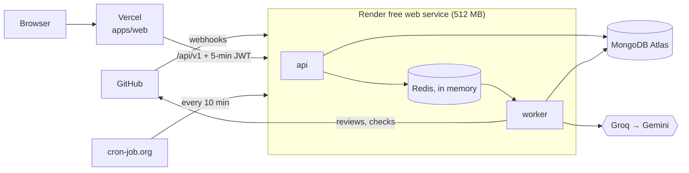

# Deploying MergeMind

MergeMind deploys for ₹0, with no credit card:

- **Backend** (api + worker + Redis in one container) on a **Render free web service**, built from the repo's `Dockerfile` with `render.yaml`.
- **Web app** (Next.js) on **Vercel** (Hobby).
- **MongoDB** on **Atlas** (M0). **LLMs**: Groq first, then Gemini.
- A free **cron-job.org** ping keeps the Render service awake.



**What the free host changes** (ADR-038):

- **No code context.** There is no room for Ollama in 512 MB, so the code index is off (`INDEX_ENABLED=false`). Reviews still run on the diff itself; the repository page shows "Not indexed".
- **Redis lives in memory.** A restart or deploy empties the queue. Two passes, about a minute after each boot, recover what it lost:
  - **Webhook redelivery:** the api asks GitHub to resend App webhooks from the last 24 hours that never got a 2xx (`WEBHOOK_REDELIVERY_ON_BOOT`).
  - **Reconciliation:** the worker re-enqueues reviews still owed to open PRs (`RECONCILE_ON_BOOT`).
- **It sleeps after 15 minutes without traffic**, so a ping every 10 minutes keeps it awake. If a ping is missed, the first webhook after the sleep times out, and the redelivery pass picks it up once the service is back.
- **Slow boot:** with 0.1 CPU the service takes about a minute to start.

## What you need

| Account | Used for | Card? |
|---|---|---|
| GitHub App | identity, webhooks, sign-in (the App from the README's Quick start) | no |
| Render | the backend (sign up with GitHub) | no |
| Vercel | the web app (sign up with GitHub) | no |
| MongoDB Atlas | the database | no |
| cron-job.org | the keep-alive ping | no |
| Groq, Google AI Studio | LLM keys (free tiers) | no |
| Langfuse | tracing (optional) | no |

## 1. MongoDB Atlas

Render's free services have no fixed outbound IP, so Atlas has to accept connections from anywhere. Protect the database with its user instead:

1. **Database Access → Add New Database User:** password authentication with a long generated password, and the role `readWrite` on the `mergemind` database only (Specific Privileges).
2. **Network Access → Add IP Address → Allow access from anywhere** (`0.0.0.0/0`).
3. **Connect → Drivers:** copy the `mongodb+srv://…` URI, put the new user in it, and add `/mergemind` before the `?`. This is `MONGODB_URI`.

## 2. The backend on Render

1. In the Render dashboard: **New → Blueprint**, then pick this repository. Render reads `render.yaml` and proposes one free web service, `mergemind-api`, in Singapore.
2. Fill in the secrets Render asks for:

   | Variable | Value |
   |---|---|
   | `MONGODB_URI` | from step 1 |
   | `GITHUB_APP_ID`, `GITHUB_APP_PRIVATE_KEY` | the App's id and private key (paste the PEM as is, or on one line with `\n`) |
   | `GITHUB_WEBHOOK_SECRET` | the App's webhook secret |
   | `API_JWT_SECRET` | a new random secret of 32+ characters; the **same** value goes to Vercel |
   | `GROQ_API_KEY`, `GOOGLE_GENERATIVE_AI_API_KEY` | your LLM keys |
   | `LANGFUSE_PUBLIC_KEY`, `LANGFUSE_SECRET_KEY` | optional; leave both empty to turn tracing off |

   Everything else (index off, recovery on, concurrency 1, models) is already set in `render.yaml`.
3. **Apply.** The first build takes a few minutes. When it is live, check it:
   `curl https://mergemind-api.onrender.com/api/v1/ready` returns `{"status":"ready",...}` (use your service's URL).

Later deploys are automatic: a push to `main` that touches the backend deploys once its CI checks pass (`autoDeployTrigger: checksPass`).

## 3. The keep-alive ping

On cron-job.org: **Create cronjob**, URL `https://<your-service>.onrender.com/api/v1/health`, every 10 minutes. It keeps the service under Render's 15-minute idle limit. A month of running 24/7 uses about 744 of the free 750 instance hours, so keep only this one free service in the Render workspace.

## 4. The web app on Vercel

1. **Add New → Project**, import this repository, and set **Root Directory** to `apps/web`. `apps/web/vercel.json` sets the workspace install, the build and the Singapore region (`sin1`, next to Render). It also skips rebuilds when only backend code changed.
2. **Environment variables** (Production):

   | Variable | Value |
   |---|---|
   | `API_BASE_URL` | `https://<your-service>.onrender.com` |
   | `API_JWT_SECRET` | the same value as on Render |
   | `BETTER_AUTH_SECRET` | a new random 32+ character secret |
   | `BETTER_AUTH_URL` | the production URL, e.g. `https://mergemind.vercel.app` |
   | `GITHUB_CLIENT_ID`, `GITHUB_CLIENT_SECRET` | the App's OAuth credentials |
   | `GITHUB_APP_SLUG` | the App's slug, e.g. `mergemind-review` |

   Leave them unset for Preview deployments: previews show the landing page but cannot sign in.
3. **Deploy.**

## 5. Point the GitHub App at production

In the App's settings (GitHub → Settings → Developer settings → GitHub Apps → your App):

- **Webhook URL:** `https://<your-service>.onrender.com/webhooks/github`. The secret stays the same.
- **Callback URL:** add `https://<your-vercel-url>/api/auth/callback/github`, and keep the localhost one for development.
- **Homepage URL:** the Vercel URL.

Then open a pull request on an installed repository: within a couple of minutes it gets a review and a `mergemind/review` check. **Advanced → Recent deliveries** in the App's settings shows the deliveries answered with 202.

**Local development after the cut-over.** Production now receives the App's webhooks. So:
- stop `smee`;
- point your local `.env` `MONGODB_URI` at the local Docker MongoDB, so development never writes to the production database;
- replay webhooks with `npm run webhook:send` (or register a second App for development).

## Operating it

| Task | How |
|---|---|
| Deploy | push to `main`; Render deploys the backend after CI passes, and Vercel deploys the web app |
| Roll back | Render: service → Events → pick an earlier deploy → **Rollback**. Vercel: Deployments → **Promote to Production** |
| Logs | Render: service → Logs. Every line is JSON from pino (api, worker); `render.processExited` means a process died and the container restarted |
| Restart | Render: service → Manual Deploy → **Restart service**. The recovery passes run about a minute later (`webhook.redeliveryPass`, `reconcile.pass` in the logs) |
| Rotate a secret | Render: Environment; Vercel: Settings → Environment Variables. `API_JWT_SECRET` must change on both sides together |

## Troubleshooting

| Symptom | Likely cause |
|---|---|
| `/api/v1/ready` answers 503 with the Mongo check failing | Atlas Network Access is missing `0.0.0.0/0`, or the user or password in `MONGODB_URI` is wrong |
| The first request after a while is slow | the service slept: check the cron-job.org job is running |
| Sign-in loops back to `/signin` | `BETTER_AUTH_URL` does not match the Vercel URL, or the callback URL is missing in the App |
| Pages show "Unexpected response" | `API_BASE_URL` or `API_JWT_SECRET` differs between Vercel and Render |
| GitHub deliveries fail with 401 | `GITHUB_WEBHOOK_SECRET` differs from the App's secret |
| A review never arrived | look for `webhook.redeliveryPass` / `reconcile.pass` after the last restart; a restart (Manual Deploy → Restart) runs both again |

## Appendix: self-hosting on a VM

With a VM of your own (any Ubuntu 24.04 host with 4 GB+ RAM and ports 80/443 open), the full stack runs with Docker Compose. It **includes Ollama**, so reviews get code context, and Redis persists to disk. The files are in `deploy/`:

| File | What it does |
|---|---|
| `compose.prod.yml` | api, worker, Redis (AOF), Ollama (`nomic-embed-text`), and Caddy, the only service with published ports |
| `Caddyfile` | automatic HTTPS for `API_DOMAIN` (for example a free DuckDNS name), proxying to the api |
| `env.production.example` | the variables; copy to `/opt/mergemind/.env.production` and `chmod 600` |
| `setup-vm.sh` | installs Docker, opens 80/443 in the firewall, clones the repo |
| `deploy.sh [ref]` | pulls, builds, starts, pulls the embedding model, and waits for readiness; pass a commit to roll back |

```bash
curl -fsSL https://raw.githubusercontent.com/Ambudlahiri144/MergeMind/main/deploy/setup-vm.sh | bash
cd /opt/mergemind && cp deploy/env.production.example .env.production && nano .env.production
chmod 600 .env.production && bash deploy/deploy.sh
```

Then use `https://<API_DOMAIN>` wherever this guide says the Render URL. On a VM, keep the defaults `INDEX_ENABLED=true` and the two recovery flags off (Redis persists).
