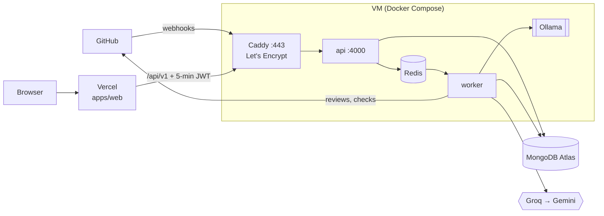

# Deploying MergeMind

MergeMind runs as two deployments at ₹0:

- **Backend** (api, worker, Redis, Ollama, Caddy) on one VM with Docker Compose. The guide uses an Oracle Cloud Always Free Ampere VM; any Ubuntu 24.04 VM with 4 GB+ RAM works.
- **Web app** (Next.js) on Vercel.
- **MongoDB** on Atlas (M0 is enough). **LLMs** are Groq first, then Gemini. **Embeddings** run on the VM (Ollama `nomic-embed-text`), so repository code is embedded on your own server.



- The browser only talks to Vercel. Vercel's server calls the api with a short-lived JWT (`API_JWT_SECRET`, the same on both sides).
- On the VM only Caddy publishes ports (80, 443). Redis, Ollama and the api stay on the internal Docker network.
- One public hostname for the backend (for example `mergemind-api.duckdns.org`) serves `/webhooks/github` and `/api/v1/*`.

## What you need

| Account | Used for | Notes |
|---|---|---|
| GitHub App | identity, webhooks, sign-in | the App from the Quick start in the README |
| MongoDB Atlas | the database | allow the VM's public IP in **Network Access** |
| Oracle Cloud (or any VM) | the backend | Ubuntu 24.04, Ampere A1, 2 OCPU / 12 GB |
| DuckDNS | a free hostname for the VM | or an A record on your own domain |
| Vercel | the web app | Hobby plan, non-commercial use |
| Groq, Google AI Studio | LLM keys | free tiers |
| Langfuse | tracing (optional) | free cloud tier |

## 1. The VM

1. **Create the instance** (Oracle: Compute → Instances → Create): image Ubuntu 24.04, shape `VM.Standard.A1.Flex` with 2 OCPU and 12 GB, your SSH public key, and a public IP (reserve it under Networking → Reserved public IPs so it never changes).
2. **Open the ports** in the subnet's security list: ingress TCP 80 and 443 and UDP 443 from `0.0.0.0/0`.
3. **Keep it from being reclaimed.** Oracle may stop Always Free instances that stay idle. Upgrading the account to Pay-As-You-Go keeps Always Free resources free and avoids idle reclaim. Add a budget alert (for example ₹100) under Billing → Budgets.
4. **Point the hostname at it:** on duckdns.org create a subdomain (e.g. `mergemind-api`) with the VM's public IP.
5. **Allow the VM in Atlas:** Network Access → Add IP Address → the VM's public IP.

## 2. The backend

On the VM:

```bash
curl -fsSL https://raw.githubusercontent.com/Ambudlahiri144/MergeMind/main/deploy/setup-vm.sh | bash
# log out and back in once, so your user is in the docker group
cd /opt/mergemind
cp deploy/env.production.example .env.production
nano .env.production          # fill in every value (see the comments in the file)
chmod 600 .env.production
bash deploy/deploy.sh
```

`setup-vm.sh` installs Docker, opens 80/443 in the VM's firewall and clones the repo. `deploy.sh` pulls `main`, builds the api and worker images on the VM, starts the stack, pulls the embedding model on first run, and waits until `/api/v1/ready` answers.

Check it from anywhere: `curl https://mergemind-api.duckdns.org/api/v1/ready` returns `{"status":"ready",...}` with a check per dependency.

### Backend environment (`.env.production`)

| Variable | Process | Notes |
|---|---|---|
| `API_DOMAIN` | Caddy | hostname only, e.g. `mergemind-api.duckdns.org` |
| `MONGODB_URI` | api, worker | Atlas `mongodb+srv://` URI |
| `GITHUB_APP_ID`, `GITHUB_APP_PRIVATE_KEY` | api, worker | PEM on one line with `\n` |
| `GITHUB_WEBHOOK_SECRET` | api | the App's webhook secret |
| `API_JWT_SECRET` | api | 32+ characters, same value as in Vercel |
| `GROQ_API_KEY`, `GOOGLE_GENERATIVE_AI_API_KEY` | worker | Gemini is used only with `LLM_FALLBACK_MODEL` set |
| `LLM_PRIMARY_MODEL`, `LLM_FALLBACK_MODEL`, `EMBEDDING_MODEL` | worker | defaults in the template |
| `LANGFUSE_*` | worker | optional |

`REDIS_URL`, `OLLAMA_BASE_URL`, `API_PORT` and `NODE_ENV` are set by `deploy/compose.prod.yml`.

## 3. The web app on Vercel

1. **Import** the GitHub repository in Vercel and set **Root Directory** to `apps/web`. `apps/web/vercel.json` sets the workspace install, the build, the Mumbai region (`bom1`) and skips rebuilds when only backend code changed.
2. **Environment variables** (Production):

   | Variable | Value |
   |---|---|
   | `API_BASE_URL` | `https://mergemind-api.duckdns.org` |
   | `API_JWT_SECRET` | the same value as on the VM |
   | `BETTER_AUTH_SECRET` | a new random 32+ character secret |
   | `BETTER_AUTH_URL` | the production URL, e.g. `https://mergemind.vercel.app` |
   | `GITHUB_CLIENT_ID`, `GITHUB_CLIENT_SECRET` | the App's OAuth credentials |
   | `GITHUB_APP_SLUG` | the App's slug, e.g. `mergemind-review` |

   Leave them unset for Preview deployments: previews show the landing page but cannot sign in.
3. **Deploy.** Every push to `main` that touches the web app deploys it.

## 4. Point the GitHub App at production

In the App's settings (GitHub → Settings → Developer settings → GitHub Apps → your App):

- **Webhook URL:** `https://mergemind-api.duckdns.org/webhooks/github`. The secret stays the same.
- **Callback URL:** add `https://<your-vercel-url>/api/auth/callback/github` (keep the localhost one for development).
- **Homepage URL:** the Vercel URL.

Then check **Advanced → Recent deliveries**: new deliveries answer 202 (accepted).

For local development after the cut-over, stop `smee`, point your local `.env` `MONGODB_URI` at the local Docker MongoDB, and replay webhooks with `npm run webhook:send` (or register a second App for development).

## Operating it

| Task | How |
|---|---|
| Deploy the latest `main` | `bash deploy/deploy.sh` |
| Roll back | `bash deploy/deploy.sh <commit-sha>` |
| Logs | `docker compose -f deploy/compose.prod.yml --env-file .env.production logs -f worker` |
| Restart one service | `docker compose -f deploy/compose.prod.yml --env-file .env.production restart api` |
| Rotate a secret | edit `.env.production` (or Vercel), then `deploy.sh` (or redeploy on Vercel). `API_JWT_SECRET` must change on both sides together. |

Logs are rotated (10 MB × 3 per service). Redis keeps its queue on a volume with append-only persistence, so a restart does not lose jobs; reviews interrupted by a restart are retried.

## Troubleshooting

| Symptom | Likely cause |
|---|---|
| `deploy.sh` public check fails, Caddy logs show ACME errors | ports 80/443 not open in the Oracle security list, or DuckDNS not pointing at the VM yet |
| `/api/v1/ready` answers 503 with the Mongo check failing | the VM's IP is not in Atlas Network Access, or `MONGODB_URI` is wrong |
| Sign-in loops back to `/signin` | `BETTER_AUTH_URL` does not match the Vercel URL, or the callback URL is missing in the App |
| Pages show "Unexpected response" | `API_BASE_URL` or `API_JWT_SECRET` differs between Vercel and the VM |
| GitHub deliveries fail with 401 | `GITHUB_WEBHOOK_SECRET` differs from the App's secret |
| Reviews have no code context | the embedding model is not pulled yet (`deploy.sh` pulls it) or the repository has not been indexed |
