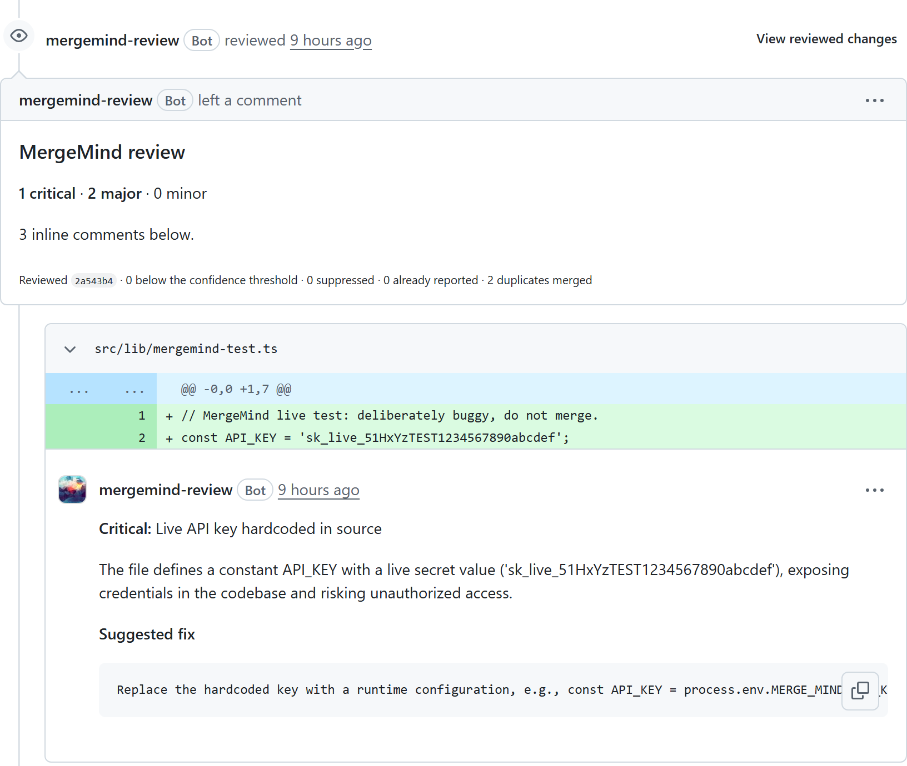
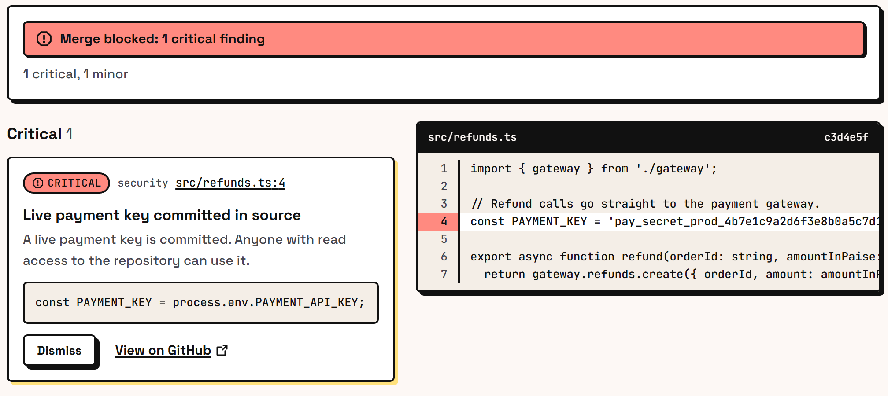
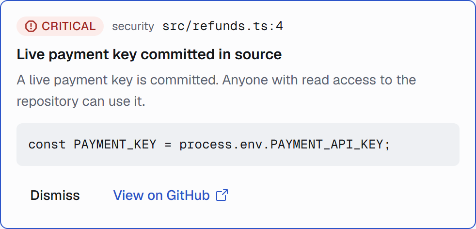
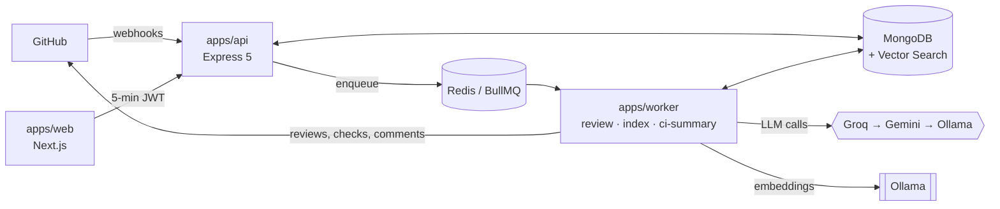

# MergeMind

**AI first-pass code review for every pull request, plus plain-language explanations of failed CI runs.** MergeMind is a GitHub App: it reviews each PR with three focused passes (security, correctness, maintainability), comments on the exact lines, gates the merge with a check run, re-reviews only what changed on each push, and explains why a GitHub Actions run failed. It runs entirely on free tiers.



## What it does

| | |
|---|---|
| **Multi-pass review** | Security, correctness and maintainability passes run in parallel; findings are Zod-validated, anchored to diff lines, merged across passes and filtered by confidence. One review per push, never a duplicate comment. |
| **Merge gate** | A `mergemind/review` check run fails on critical findings (configurable: `critical`, `major` or `never`). |
| **Incremental re-review** | A push re-reviews only the hunks that changed since the last review. Fixed findings get a "Resolved in `<sha>`" reply. |
| **Code context** | The default branch is chunked by symbol (tree-sitter) and embedded locally with Ollama; reviews retrieve related definitions and callers through MongoDB Vector Search. |
| **CI failure summaries** | When a workflow fails on a PR, MergeMind reads the failed job's log and posts one comment with the failing step, the likely cause and the evidence lines. It turns into "passing again" once the workflow succeeds. |
| **Policy file** | `.mergemind.yml` on the base branch sets passes, confidence, ignored paths, the gate and the size limit. A PR cannot relax its own review. |
| **Web app** | Sign in with GitHub to browse repositories, PR timelines and findings, dismiss false positives (a per-repo suppression), rerun a review, reindex code and set the monthly token budget. |
| **Cost and privacy controls** | Per-installation token budget, a provider allowlist for private repositories, token redaction in CI logs, and Langfuse tracing with private inputs redacted. |

<table>
  <tr>
    <td></td>
    <td></td>
  </tr>
</table>

<sub>App screenshots use sample data.</sub>

## Architecture



- **apps/api:** HMAC-verified webhooks (idempotent per delivery), and the authenticated `/api/v1` the web app uses.
- **apps/worker:** BullMQ processors. The review pipeline is crash-safe: a retried job adopts the review it already posted instead of posting twice.
- **packages:** `shared` (Zod schemas, errors, policy), `db` (Mongoose repositories), `llm` (provider chain with fallback, repair re-ask and circuit breaker; prompts; embeddings), `github` (Octokit client, diff parser, markdown).
- More detail: [Architecture.md](Architecture.md), [PRD.md](PRD.md), [Testing.md](Testing.md), [Design.md](Design.md).

**Stack:** TypeScript (strict), Node 22, Express 5, BullMQ, MongoDB (Atlas or `atlas-local`), Next.js 16, Tailwind 4, Better Auth, Vercel AI SDK, tree-sitter, Ollama, Langfuse, Vitest, Testcontainers, MSW, Playwright, axe.

## Review quality

The seeded-bug benchmark (`npm run eval`) runs 40 small PRs (30 with one known bug each, across 10 categories, and 10 clean ones) through the real pipeline on the production provider chain.

| Prompts | Model | Precision | Recall | False positives | Reports on clean PRs |
|---|---|---|---|---|---|
| v2 | Groq gpt-oss-120b | 40.0% | 100% | 45 | 29 |
| v2 | Gemini 3.5 Flash-Lite | 74.3% | 90.0% | 9 | 5 |
| **v3 (current)** | Gemini 3.5 Flash-Lite | **86.7%** | **90.0%** | **4** | **2** |

Targets: precision ≥ 70%, recall ≥ 50%. The v3 prompts stop the passes from speculating about code outside the diff, which halved the false positives on the same model with no loss of recall. v3 has not yet been measured on Groq, the chain's first provider; Groq's free daily token limit covers about one full run.

Precision counts critical and major reports; recall counts seeded critical and major bugs. Reports on clean PRs count as false positives. Details: [Testing.md](Testing.md).

## Quick start

**You need:** Node 22, Docker, [Ollama](https://ollama.com/download), and a GitHub account.

1. **Install and start the data stores**
   ```bash
   npm install
   docker compose up -d                 # MongoDB (atlas-local, with Vector Search) + Redis
   ollama pull nomic-embed-text         # local embeddings for the code index
   ```
2. **Create a GitHub App** (Settings → Developer settings → GitHub Apps).
   - Repository permissions: **Checks** read and write, **Pull requests** read and write, **Contents** read, **Actions** read, **Metadata** read.
   - Organization permissions: **Members** read (for web sign-in on org installations).
   - Subscribe to events: **Pull request**, **Push**, **Workflow run**, **Repository**.
   - Webhook URL: a [smee.io](https://smee.io) channel; set a webhook secret.
   - Callback URL: `http://localhost:3000/api/auth/callback/github`; generate a client secret and a private key.
3. **Configure** `cp .env.example .env`, then fill in the App id, private key, webhook secret, client id and secret, a free [Groq](https://console.groq.com) key, and two random secrets (`BETTER_AUTH_SECRET`, `API_JWT_SECRET`).
4. **Run it**
   ```bash
   npx -p smee-client smee -u <your smee url> -t http://localhost:4000/webhooks/github
   npm run dev                          # api :4000, worker, web :3000
   ```
5. Install the App on a repository, open a pull request, and sign in at `http://localhost:3000`.

## Deploy

MergeMind deploys for free with no credit card. The backend (api, worker and Redis in one container) runs on a Render free web service from `render.yaml`, and the web app runs on Vercel. A free cron ping keeps the backend awake, and on every restart MergeMind redelivers missed webhooks and re-enqueues reviews still owed, so no review is lost. [Deploy.md](Deploy.md) has the steps, plus a Docker Compose setup for a VM of your own (with local embeddings).

## Development

| Command | What it does |
|---|---|
| `npm run dev` | api, worker and web together |
| `npm test` | Unit and contract tests (Vitest) |
| `npm run test:int` | Integration tests on real MongoDB and Redis containers |
| `npm run test:e2e` | Playwright journeys with axe accessibility checks |
| `npm run lint` / `npm run typecheck` / `npm run build` | Static checks and build |
| `npm run eval` | The seeded-bug benchmark on real providers |
| `npm run chaos:check -- <owner/repo> <pr>` | Kills the worker mid-review and checks the retry posts no duplicate |
| `npm run webhook:send -- <fixture>` | Sends a signed webhook fixture to the local api |

CI runs lint, types, unit, integration and E2E on every push and pull request; the benchmark runs on demand.

## Security and privacy

- Private repositories only use the providers on the installation's allowlist (Groq and local Ollama by default); embeddings always stay on your machine.
- CI logs are redacted for common token formats before they reach a model or a comment.
- The App asks only for read access to code. Webhooks are HMAC-verified, every external input is validated, and secrets never leave `.env`.

## License

[MIT](LICENSE)
